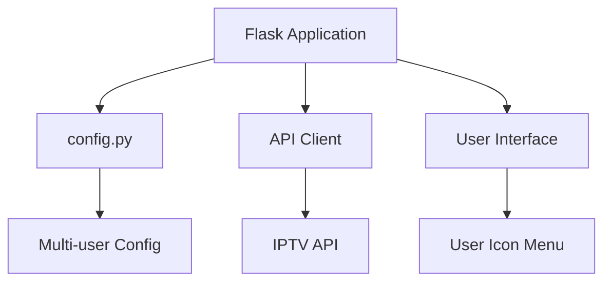
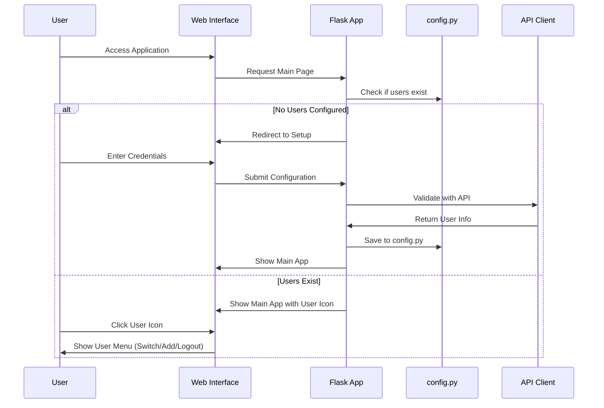

# Design Document

## Overview

The user authentication system will be implemented as a simple extension to the existing Flask application. All configuration will be stored in the existing `config.py` file with support for multiple users. The system will provide a clean user interface with a user icon in the top navigation for managing accounts.

## Architecture

### Simplified Architecture



### User Flow



## Components and Interfaces

### 1. Enhanced config.py

**Purpose:** Store all user configurations in a simple Python dictionary structure.

**Configuration Structure:**
```python
# Multi-user configuration
USERS = {
    "user_001": {
        "id": "user_001",
        "server": "http://[server_url]:[port]",
        "username": "[username]",
        "password": "[password]",  # Plain text for simplicity
        "user_info": {
            "username": "[username]",
            "auth": 1,
            "status": "Active",
            "exp_date": "1781337360",
            "is_trial": "0",
            "active_cons": "0",
            "created_at": "1644738976",
            "max_connections": "1",
            "allowed_output_formats": ["m3u8", "ts", "rtmp"]
        },
        "server_info": {
            "url": "[server_url]",
            "port": "[port]",
            "https_port": "[https_port]",
            "server_protocol": "http",
            "timezone": "[timezone]"
        }
    }
}

# Current active user
CURRENT_USER = "user_001"  # or None if no user selected

# Legacy support (points to current user's config)
BASE_URL = USERS[CURRENT_USER]["server"] if CURRENT_USER and CURRENT_USER in USERS else ""
USERNAME = USERS[CURRENT_USER]["username"] if CURRENT_USER and CURRENT_USER in USERS else ""
PASSWORD = USERS[CURRENT_USER]["password"] if CURRENT_USER and CURRENT_USER in USERS else ""
```

### 2. Simple API Client Functions

**Purpose:** Add functions to app.py for API communication.

**Key Functions:**
- `test_connection(server, username, password)` - Test API connectivity
- `get_user_info(server, username, password)` - Retrieve user information
- `validate_and_save_user(server, username, password)` - Validate and save user config

### 3. User Interface Components

#### User Icon in Navigation
- Clickable user icon in top-right corner of all pages
- Shows current user's username or "Guest" if not logged in
- Dropdown menu with options:
  - View User Info
  - Switch User (if multiple users exist)
  - Add New User
  - Logout

#### Setup Page (`templates/setup.html`)
- Simple form with server URL, username, password fields
- Test connection button
- Save and continue button
- Error display area

#### User Info Modal/Page
- Display current user information from API
- Account status, expiry date, connection limits
- Edit configuration option
- Delete user option (if multiple users exist)

## Data Models

### Simple Dictionary-Based Models

**User Configuration (in config.py):**
```python
user_config = {
    "id": "user_001",
    "server": "http://[server_url]:[port]",
    "username": "[username]",
    "password": "[password]",
    "user_info": {...},  # API response data
    "server_info": {...}  # API response data
}
```

**Helper Functions (in app.py):**
```python
def get_current_user():
    """Get current user configuration."""
    if CURRENT_USER and CURRENT_USER in USERS:
        return USERS[CURRENT_USER]
    return None

def is_user_authenticated():
    """Check if current user is authenticated."""
    user = get_current_user()
    return user and user.get('user_info', {}).get('auth') == 1

def switch_user(user_id):
    """Switch to different user."""
    # Update config.py file with new CURRENT_USER
    pass
```

## Error Handling

### Simple Error Messages

1. **Network Errors**
   - Connection timeout: "Unable to connect to server. Please check your connection."
   - Server unreachable: "Server is not responding. Please check the server URL."

2. **Authentication Errors**
   - Invalid credentials: "Invalid username or password."
   - Account inactive: "Your account is not active."

3. **Configuration Errors**
   - Invalid server URL: "Please enter a valid server URL."
   - Missing fields: "Please fill in all required fields."

### Error Display
- Show errors directly in the web interface using flash messages
- Use simple try/catch blocks in route handlers
- Display user-friendly error messages in forms

## Implementation Details

### File Structure
```
project/
├── app.py (enhanced with auth functions)
├── config.py (enhanced with multi-user support)
├── templates/
│   ├── base.html (updated with user icon)
│   ├── setup.html (new setup page)
│   └── user_info.html (new user info modal)
└── static/
    ├── css/ (styles for user interface)
    └── js/ (JavaScript for user interactions)
```

### Key Implementation Steps

1. **Update config.py** - Add USERS dictionary and CURRENT_USER variable
2. **Enhance app.py** - Add API functions and user management routes
3. **Update base.html** - Add user icon and dropdown menu
4. **Create setup.html** - Simple setup form for new users
5. **Create user_info.html** - User information display and management
6. **Add JavaScript** - Handle user interactions and AJAX calls

### User Interface Design

#### User Icon (Top Navigation)
```html
<div class="user-menu">
    <div class="user-icon" onclick="toggleUserMenu()">
        <i class="fas fa-user"></i>
        <span class="username">{{ current_user.username if current_user else 'Guest' }}</span>
    </div>
    <div class="user-dropdown" id="userDropdown">
        <a href="#" onclick="showUserInfo()">User Info</a>
        <a href="#" onclick="showUserSwitcher()">Switch User</a>
        <a href="#" onclick="showAddUser()">Add User</a>
        <a href="/logout">Logout</a>
    </div>
</div>
```

#### Setup Form
```html
<form id="setupForm" method="POST">
    <input type="text" name="server" placeholder="Server URL" required>
    <input type="text" name="username" placeholder="Username" required>
    <input type="password" name="password" placeholder="Password" required>
    <button type="button" onclick="testConnection()">Test Connection</button>
    <button type="submit">Save & Continue</button>
</form>
```

### Security & Performance

- **Simple Security**: Store passwords in plain text in config.py (acceptable for local application)
- **Session Management**: Use Flask sessions to track current user
- **Performance**: No additional caching layers, use existing cache system
- **Error Handling**: Simple try/catch with user-friendly messages